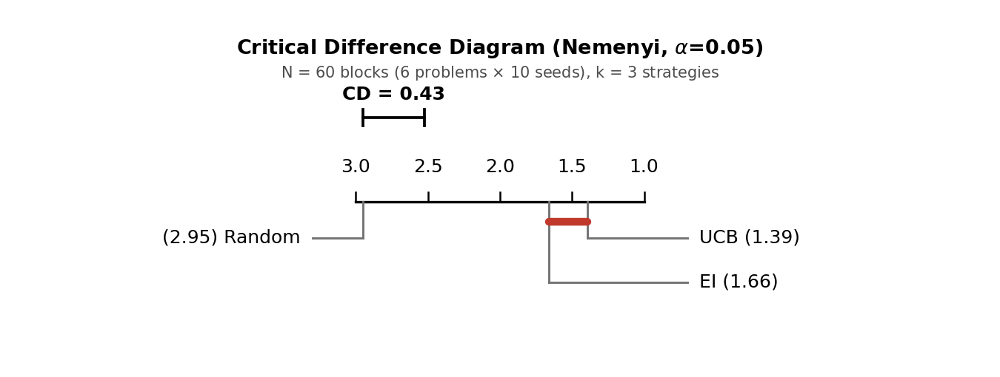
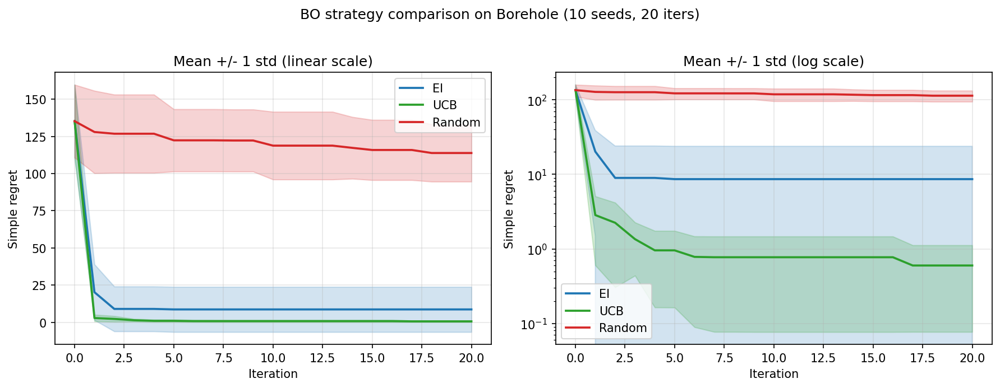
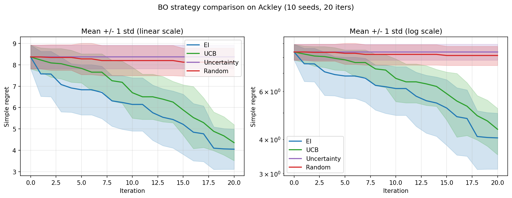

# al-benchmark

A systematic benchmark of four Bayesian optimization (BO) acquisition strategies across six problems (dimensions 2–10), with rigorous non-parametric statistical validation (Friedman + Nemenyi, N = 60).

All four strategies share an identical normalized Gaussian-process surrogate and BO loop, so any performance difference is attributable solely to the acquisition function.

## Key finding

The 240 BO runs partition the four strategies into **two statistically separated equivalence classes**:

- **Balanced strategies — {EI, UCB}**: statistically indistinguishable from each other (Nemenyi *p* = 0.404), both significantly better than the pure-exploration strategies.
- **Pure-exploration strategies — {Uncertainty, Random}**: statistically indistinguishable from each other (Nemenyi *p* = 0.974), both significantly worse.

The sharpest statement of this result is the **Uncertainty–Random tie**. Uncertainty fits the *same* GP as EI and UCB and selects the point of maximum posterior standard deviation — yet it ranks indistinguishably from blind Sobol sampling. Using a GP for exploration only, without any exploitation of the posterior mean, provides no measurable advantage over random search. **Exploitation of the posterior mean — not the uncertainty estimate alone — is the necessary condition for sample-efficient BO.**

A secondary finding: **GP input normalization to known problem bounds is a first-class engineering requirement** on multi-scale problems. Omitting it degraded BO to random-search performance on Piston (7D, inputs spanning ~7 orders of magnitude), while leaving the Random baseline unaffected — isolating the fault to the surrogate.

## Overview

Bayesian optimization builds a probabilistic surrogate (a Gaussian process) of an expensive black-box objective and uses an acquisition function to decide where to evaluate next, balancing exploitation of high-mean regions against exploration of high-variance regions. This project asks a focused question: **is the GP's uncertainty estimate alone sufficient to beat random search, or is exploitation the necessary ingredient?**

To answer it, the benchmark evaluates:

- **4 acquisition strategies** spanning the full exploration–exploitation spectrum: EI, UCB (β = 2), Uncertainty (pure exploration), and Random (Sobol baseline).
- **6 problems** across dimensions 2–10 and two families: classical synthetic functions and physics-based engineering test functions.
- **10 seeds** per strategy–problem pair → **240 BO runs** total, each with 20 sequential iterations.
- A **Friedman + Nemenyi** non-parametric framework (N = 60 blocks, k = 4), following Demšar (2006), chosen because regret distributions across heterogeneous problems are non-Gaussian and not comparable by mean alone.

## Results

### Statistical ranking

The Friedman test strongly rejects the null hypothesis of equal expected ranks: χ²(3) = 128.82, *p* = 9.73 × 10⁻²⁸ (N = 60, k = 4). Average ranks (lower is better):

| Strategy | Avg. rank | Class |
|---|---|---|
| UCB | 1.39 | Balanced |
| EI | 1.76 | Balanced |
| Uncertainty | 3.38 | Pure exploration |
| Random | 3.48 | Pure exploration |

The Critical Difference diagram (α = 0.05, CD = 0.61) shows the two cliques: horizontal bars connect strategies that are *not* significantly different. The inter-class rank gap (1.62) is more than 2.5× the critical difference.



All cross-class Nemenyi comparisons are significant (*p* < 10⁻⁶); both within-class comparisons are not (EI–UCB *p* = 0.404; Uncertainty–Random *p* = 0.974).

### Per-problem median regret

Median final simple regret after 20 iterations (10 seeds; lower is better; **bold** = best per row):

| Problem (d) | EI | UCB | Uncertainty | Random |
|---|---|---|---|---|
| Branin (2) | 0.026 | **0.015** | 2.676 | 0.920 |
| Six-Hump Camel (2) | **0.057** | 0.287 | 0.936 | 0.924 |
| Hartmann-6 (6) | **0.183** | 0.254 | 1.913 | 1.802 |
| Piston (7) | 0.016 | **0.001** | 0.033 | 0.395 |
| Borehole (8) | 2.409 | **0.424** | 5.747 | 111.642 |
| Ackley-10D (10) | **3.800** | 4.295 | 8.441 | 8.272 |

The balanced strategies lead on every problem; the pure-exploration strategies never win a row. The magnitude of the advantage varies with structure: on Borehole, UCB's median regret is ~263× lower than Random's, while on the highly multimodal Ackley-10D the EI-over-Random gap collapses to ~2× — consistent with the curse of dimensionality degrading GP calibration at a fixed 20-iteration budget.

### Regret trajectories

Mean regret ± one standard deviation over 20 iterations, for the two most contrasting problems:



On Borehole (8D), EI and UCB converge rapidly while Uncertainty and Random barely improve. (The wide EI band is driven by two outlier seeds with elevated final regret, inflating the mean to 8.63 against a median of 2.41.)



On Ackley-10D, all four strategies remain at high regret; the balanced strategies hold only a marginal but consistent advantage — illustrating dimensionality-driven degradation of GP calibration.

## Methods

**Surrogate.** BoTorch's `SingleTaskGP` with an RBF kernel and automatic relevance determination (ARD, one lengthscale per input dimension). Hyperparameters are fitted by maximizing the exact marginal log-likelihood at every iteration. Inputs are normalized to the unit hypercube using the *known, fixed* problem bounds (`Normalize(d, bounds=problem.bounds)`) and outputs are standardized (`Standardize(m=1)`). Fixing the normalization range to the full search space — rather than letting it drift with the data — is what makes the GP stable on multi-scale engineering inputs.

**BO protocol.** Initial design of 2·d Sobol points, then 20 sequential iterations. Acquisition functions are maximized with BoTorch's `optimize_acqf` multi-start optimization (`num_restarts=10`, `raw_samples=64`). All tensors use `torch.float64`. Performance is measured by simple regret, r = f\* − max observed value (all problems framed as maximization).

**Acquisition strategies.**

| Strategy | Acquisition | Uses μ? | Uses σ? |
|---|---|---|---|
| EI | `ExpectedImprovement` | ✓ | ✓ |
| UCB | `UpperConfidenceBound` (β = 2) | ✓ | ✓ |
| Uncertainty | `PosteriorStandardDeviation` | | ✓ |
| Random | Sobol sampling (no GP) | | |

**Problem suite.**

| Problem | Type | d | f\* |
|---|---|---|---|
| Branin | Synthetic | 2 | −0.3979 |
| Six-Hump Camel | Synthetic | 2 | 1.0316 |
| Hartmann-6 | Synthetic | 6 | 3.3224 |
| Piston | Engineering | 7 | 1.20 |
| Borehole | Engineering | 8 | 310.0 |
| Ackley-10D | Synthetic | 10 | 0.0 |

Synthetic problems wrap BoTorch's built-in test functions. Engineering problems (Borehole from SMT's WaterFlow; Piston implemented manually from the standard closed-form formula) model physical systems with heterogeneous input scales. For both engineering functions the global maximum lies at a box vertex, so f\* is obtained by exhaustive corner evaluation (2^d vertices) plus a small conservative buffer to guarantee non-negative simple regret.

**Statistics.** Friedman omnibus rank test followed, on rejection, by Nemenyi all-pairs post-hoc at α = 0.05. Each (problem, seed) pair is one block, giving N = 60 blocks and k = 4 strategies. The critical difference CD = q_α · √(k(k+1)/6N) ≈ 0.61 is computed analytically inside the plotting function so it stays correct under any change to N or k.

## Repository structure

```
al-benchmark/
├── src/al_benchmark/
│   ├── problems/          # BaseProblem (ABC) + synthetic.py, engineering.py
│   ├── strategies/        # BaseStrategy (ABC) + ei, ucb, uncertainty, random
│   ├── surrogates/gp.py   # Normalized SingleTaskGP wrapper
│   └── core/bo_loop.py    # Main BO loop tying surrogate + strategy together
├── experiments/
│   ├── exp_01_branin_strategies.py
│   ├── exp_02_strategies_per_problem.py   # Per-problem benchmark (argparse CLI)
│   └── exp_03_friedman_nemenyi.py         # Friedman + Nemenyi + CD diagram
├── notebooks/             # Exploratory analysis
├── results/               # JSON results (selected summaries tracked)
├── figures/               # Generated figures (selected display figures tracked)
├── report/                # LaTeX sources + compiled PDF
├── docs/                  # Lab notebook, reading log
└── tests/
```

## Installation

Requires `conda` and Python 3.11.

```bash
conda env create -f environment.yml
conda activate oas-test
pip install -e .
```

The editable install (`pip install -e .`) makes `al_benchmark` importable across the project. Pinned dependencies are also available in `requirements.txt`.

## Reproducing experiments

Run a single problem across all strategies (10 seeds, 20 iterations):

```bash
python experiments/exp_02_strategies_per_problem.py --problem branin
```

Available problems: `branin`, `sixhumpcamel`, `hartmann6`, `piston`, `borehole`, `ackley`. Each run writes a JSON result file to `results/` and a figure to `figures/`.

Run the statistical analysis (Friedman + Nemenyi + CD diagram) over the full 6-problem suite:

```bash
python experiments/exp_03_friedman_nemenyi.py
```

This produces the Critical Difference diagram and a statistics summary (`results/exp_03_stats_summary.json`).

## Report

The full 8-page technical write-up is available as a compiled PDF:

**[report/bo_benchmark_report.pdf](report/bo_benchmark_report.pdf)**

LaTeX sources (section `.tex` files, `references.bib`, and figures) are in [`report/`](report/) and compile standalone with pdfLaTeX + bibtex.

## Selected references

- Frazier (2018), *A Tutorial on Bayesian Optimization*. arXiv:1807.02811.
- De Ath et al. (2019), *Greed is Good? On the Choice of Exploitation versus Exploration in Bayesian Optimization*. arXiv:1911.12809.
- Shahriari et al. (2016), *Taking the Human Out of the Loop: A Review of Bayesian Optimization*. Proceedings of the IEEE 104(1):148–175.
- Demšar (2006), *Statistical Comparisons of Classifiers over Multiple Data Sets*. JMLR 7:1–30.
- Balandat et al. (2020), *BoTorch: A Framework for Efficient Monte-Carlo Bayesian Optimization*. NeurIPS 33. arXiv:1910.06403.
